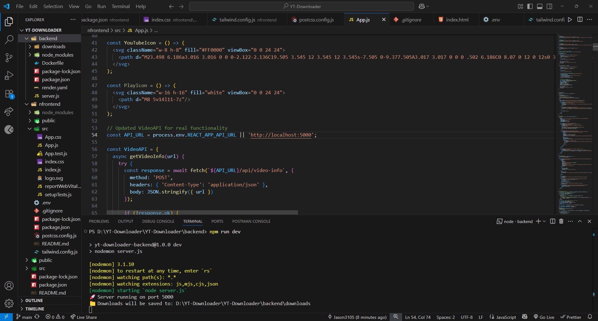
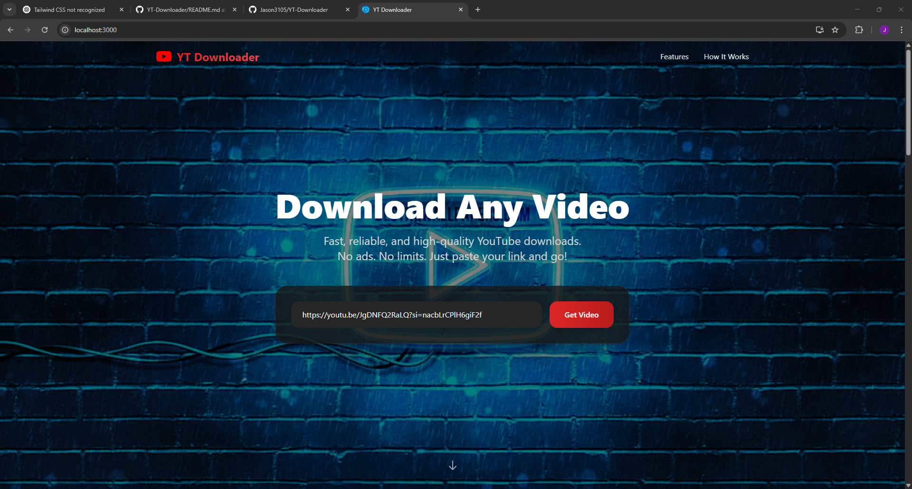
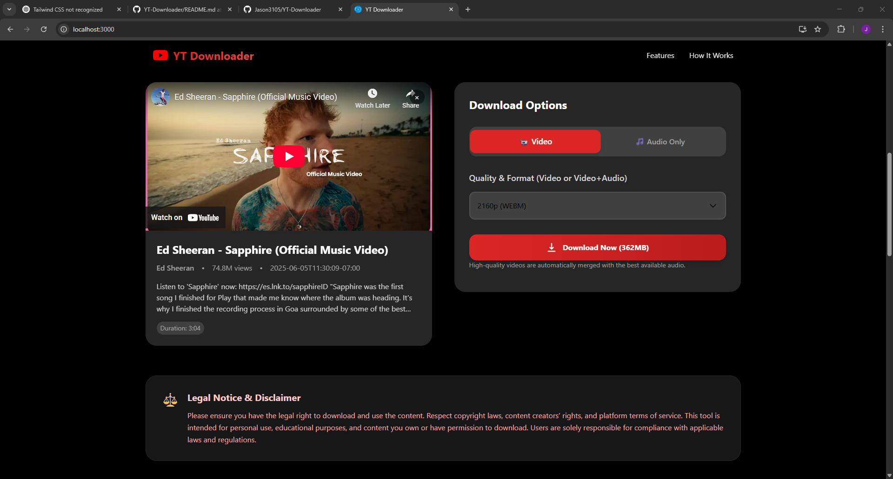
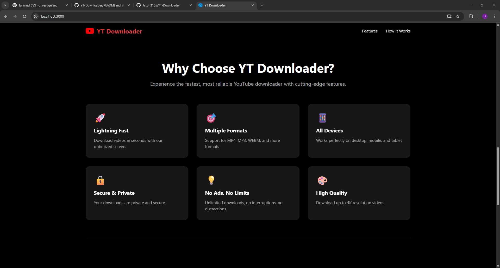
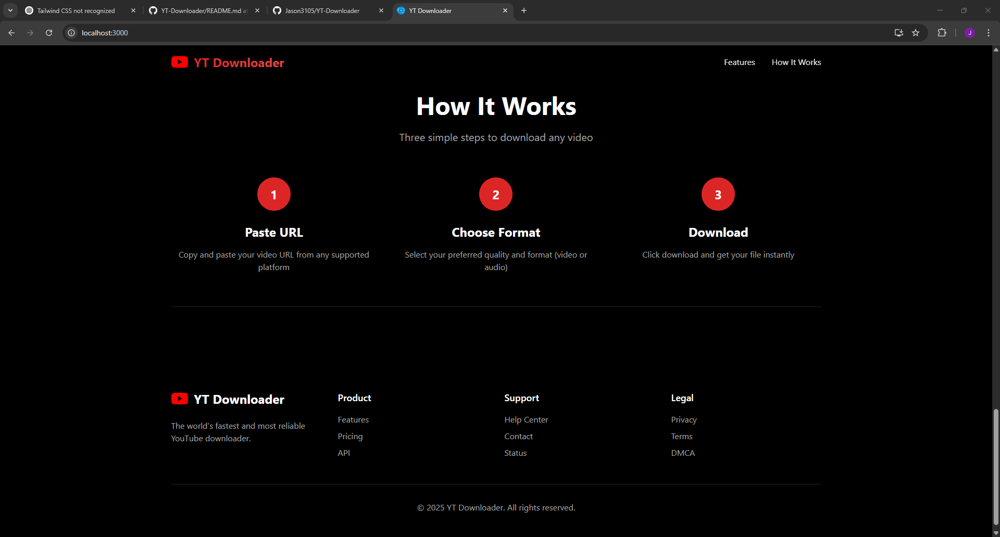
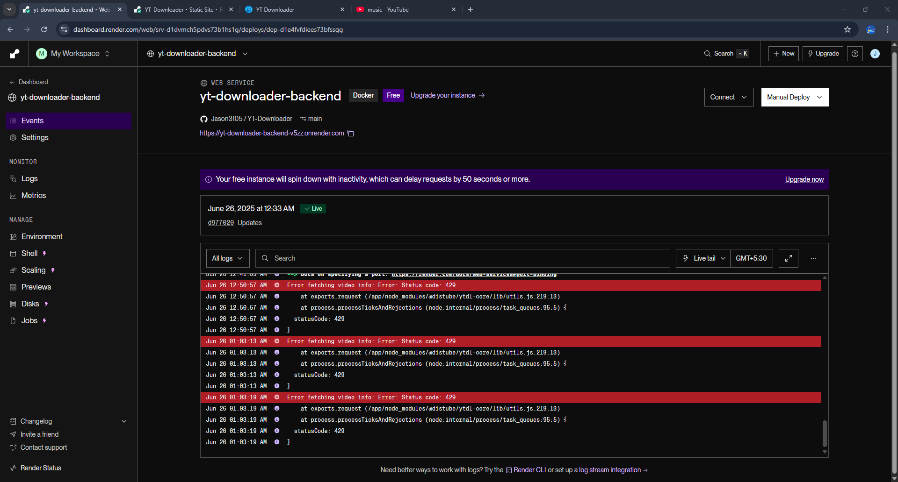

# YT Downloader 🎬

YT Downloader is a full-stack web application that lets users download YouTube videos in multiple formats, including **MP4 (video + audio)** and **MP3 (audio-only)**.
It features a **React** frontend and a **Node.js / Express** backend with **FFmpeg** integration for seamless audio/video merging.

---

## ✨ Features

### 🔗 YouTube Download
- Download videos in MP4 (highest available quality)
- Download audio-only in MP3
- Displays basic video details (title, duration, thumbnail)
- Progress feedback and error handling

### ⚙️ Backend API
- **POST `/api/video-info`** – fetch video metadata  
- **GET `/api/download?type=mp4|mp3&url=…`** – stream merged file to client  
- Built with `ytdl-core`, `ffmpeg-static`, and `fluent-ffmpeg`
- Graceful handling of rate limits (HTTP 429)

### 🎯 Responsive Frontend
- React + Tailwind CSS for a clean, mobile-friendly UI
- Environment-based API URL (`REACT_APP_BACKEND_URL`)
- One-click download workflow

---

## 🛠️ Technologies Used

<p align="left">
   React  
   Node.js  
   Express  
   FFmpeg  
   Tailwind CSS  
</p>

---

## 🏁 Getting Started

### Prerequisites
* Node.js (v14 +)  
* npm (v6 +)  
* FFmpeg (bundled via `ffmpeg-static`, no local install required)

### Installation

```bash
# 1. Clone repo
git clone https://github.com/yourusername/yt-downloader.git
cd yt-downloader

# 2. Backend setup
cd backend
npm install
cp .env.example .env          # edit if needed
npm start                     # runs on http://localhost:5000

# 3. Frontend setup (new terminal)
cd nfrontend
npm install
cp .env.example .env          # set REACT_APP_BACKEND_URL
npm start                     # runs on http://localhost:3000
```

## 📁 Project Structure

<pre>
YT-Downloader/
├── backend/                        # Backend code (Express server)
│   ├── downloads/                  # Temporary files (MP3/MP4)
│   ├── node_modules/               # Backend dependencies
│   ├── Dockerfile                  # Docker config for Render
│   ├── package-lock.json           # Lock file for backend
│   ├── package.json                # Backend package config
│   ├── render.yaml                 # Render deployment file
│   └── server.js                   # Entry point for Express server
│
├── nfrontend/                      # Frontend (React + Tailwind CSS)
│   ├── node_modules/               # Frontend dependencies
│   ├── public/                     # Static public files (index.html, etc.)
│   ├── src/                        # Frontend source code
│   │   ├── App.css                 # App styling
│   │   ├── App.js                  # Root component
│   │   ├── App.test.js             # App tests
│   │   ├── index.css               # Tailwind and global styles
│   │   ├── index.js                # React DOM entry point
│   │   ├── logo.svg                # Logo asset
│   │   ├── reportWebVitals.js      # Performance monitoring
│   │   └── setupTests.js           # Testing setup
│   ├── .env                        # Frontend environment variables
│   ├── .gitignore                  # Git ignore config
│   ├── package-lock.json           # Lock file for frontend
│   ├── package.json                # Frontend package config
│   ├── postcss.config.js           # Tailwind/PostCSS setup
│   ├── tailwind.config.js          # Tailwind configuration
│   └── README.md                   # (Optional) frontend-specific README
│
├── README.md                       # 📘 Main project documentation
</pre>

## 🛡️ Notes & Limitations  

- **YouTube Rate-Limiting (HTTP 429)**  
  YouTube aggressively throttles or blocks repeated requests from cloud-hosted IP addresses (Render, Vercel, Railway, etc.).  
  Implement **caching**, **exponential back-off/retries**, or an **IP-rotating proxy** to reduce 429 errors.
  (Reach out to me if you've a solution).

- **Server-Side FFmpeg Load**  
  FFmpeg runs entirely on your server. Each merge/transcode job can briefly spike **CPU** and **memory** usage.  
  On free-tier hosts (e.g., Render free instance), heavy jobs may be killed or the service may restart.

- **Cold-Start Delays / Timeouts**  
  Free tiers often “sleep” after inactivity. The first request has to wake the server, and long-running FFmpeg
  processes risk hitting the platform’s request-timeout (typically 30–60 s).

- **Terms of Service**  
  Downloading YouTube content may violate YouTube’s ToS. Ensure end-users have the right to download the material
  and consider adding a usage disclaimer.


## 📸 Screenshots


  
  
  
 
  
 
